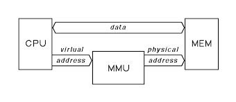

# A Programmer's Daily Life: Understanding Compiled Languages

Suppose you write a C program as a developer. You will be working with a compiled language. As a programmer, there are three types of languages: compiled, interpreted, and virtual machine.

## 1. Compiled Languages
These are translated directly to machine code by a compiler. The CPU runs the final binary.

## 2. Interpreted Languages
These are read and executed line by line by an interpreter, without producing a binary.

**Python (CPython)** — source → bytecode → Python VM executes

```
Your code (.py)
       ↓ compiled to bytecode (.pyc)
Python Virtual Machine (PVM) interprets bytecode
       ↓
Executed step by step
```

The PVM executes the bytecode instruction by instruction (interpreted), not directly by the CPU.

## 3. Virtual Machine
These are compiled to an intermediate form called bytecode, then executed by a virtual machine.

> **Note:** Assembly is just a human-readable form of machine code.

---

## Working with Compiled Languages

Our interest here is in compiled languages:

```c
#include <stdio.h>
#include <stdlib.h>

int main() {
    int a = 5;
    int b = 7;
    int c = 8;
    int sum = a + b + c;
    return sum;
}
```

All you care about is writing the code. After you think you've finished the code "painfully", you will run:

```bash
gcc main.c -o main
```

### What is `gcc main.c -o main`?
This command will preprocess (getting the code from the includes), assemble the source code, and then link it (so it is ready for you to run).

To see the preprocessing stage:
```bash
gcc -E main.c -o prep
```

To see the assembly output:
```bash
gcc -S main.c -o asm
```

This is an example of the compilation process.

---

## Understanding How the CPU Works

Do you think your CPU understands this? `int a = 4;`, `sum = a + b + c;`

Look at how the CPU is structured:




How can it understand `sum = a + b + c`?

We need to find a syntax that uses the CPU resources (RAM, registers, etc.). Let's discover it together. Note that we will find it for the shown CPU, because CPUs differ (this is what we call CPU architecture).

### CPU Operations

- The CPU needs someone to tell it to **move** the value (local variable) at this address (memory location) to another local variable (sum). Think: `MOV`.

- The CPU needs a place to **store** the moved value so it can access it quickly (not go to the memory and `MOV` again). Let's call these places **General Purpose Registers**.

- The CPU needs to store the address of the pointer to this memory, so we use `LEA`.

- The CPU needs to perform arithmetic: `ADD`, `SUB`, `MUL`, `DIV`. (The CPU can't ADD or SUB two memory addresses directly; instead, ADD, SUB, MUL, and IMUL work with registers.)

- The CPU needs to execute many more instructions...

---

## General Purpose Registers

| 64-bit | 32-bit | 16-bit | 8 high bits (AH, etc.) | 8-bit | Description |
|--------|--------|--------|------------------------|--------|-------------|
| RAX    | EAX    | AX     | AH                     | AL     | Accumulator |
| RBX    | EBX    | BX     | BH                     | BL     | Base |
| RCX    | ECX    | CX     | CH                     | CL     | Counter |
| RDX    | EDX    | DX     | DH                     | DL     | Data (extends accumulator) |
| RSI    | ESI    | SI     | N/A                    | SIL    | Source index for string ops |
| RDI    | EDI    | DI     | N/A                    | DIL    | Destination index for string ops |
| RSP    | ESP    | SP     | N/A                    | SPL    | Stack Pointer |
| RBP    | EBP    | BP     | N/A                    | BPL    | Base Pointer (stack frames) |
| R8     | R8D    | R8W    | N/A                    | R8B    | General purpose |
| R9     | R9D    | R9W    | N/A                    | R9B    | General purpose |
| R10    | R10D   | R10W   | N/A                    | R10B   | General purpose |
| R11    | R11D   | R11W   | N/A                    | R11B   | General purpose |
| R12    | R12D   | R12W   | N/A                    | R12B   | General purpose |
| R13    | R13D   | R13W   | N/A                    | R13B   | General purpose |
| R14    | R14D   | R14W   | N/A                    | R14B   | General purpose |
| R15    | R15D   | R15W   | N/A                    | R15B   | General purpose |

### Pointer Registers

| 64-bit | 32-bit | 16-bit | Description |
|--------|--------|--------|-------------|
| RIP    | EIP    | IP     | Instruction Pointer |

---

## Assembly is CPU-Specific

Assembly is not universal. It is specific to the processor architecture (the CPU family). Each CPU has its own instruction set, registers, and assembly syntax.

| CPU Architecture             | Assembly Example     |
|-----------------------------|----------------------|
| x86 (32-bit Intel/AMD)      | mov eax, 5           |
| x86_64 (64-bit Intel/AMD)   | mov rax, 5           |
| ARM (phones, Raspberry Pi)  | MOV R0, #5           |
| RISC-V                      | addi x1, x0, 5       |
| MIPS                        | addi $t0, $zero, 5   |

Our interest here will be in **x86_64 (64-bit)** architecture.

---

## Segment Registers

| Register | Name            | Purpose                                                                                                                                                                               |
| -------- | --------------- | ------------------------------------------------------------------------------------------------------------------------------------------------------------------------------------- |
| **CS**   | Code Segment    | Points to the segment that contains the program instructions (machine code). The CPU uses CS together with the Instruction Pointer (IP/RIP) to fetch the next instruction to execute. |
| **DS**   | Data Segment    | Points to the segment that contains program data like variables and constants. Used by default for most memory access instructions.                                                   |
| **SS**   | Stack Segment   | Points to the segment that contains the stack, which stores function return addresses, local variables, and parameters. Used with the stack pointer (SP/RSP).                         |
| **ES**   | Extra Segment   | An additional data segment, mainly used by string operations (like `MOVS`, `LODS`, `STOS`) as a destination segment.                                                                  |
| **FS**   | Extra Segment 2 | General-purpose segment, often used in modern systems for thread-local storage (TLS).                                                                                                 |
| **GS**   | Extra Segment 3 | Also general-purpose, commonly used in 64-bit Linux for accessing process or CPU-specific data structures.                                                                            |

### Are these still used today?

- **In 32-bit mode (x86):** Segmentation is still supported but rarely used except for special purposes.

- **In 64-bit mode (x86_64):** Segmentation is almost disabled. Only FS and GS are still useful, mainly for thread-local storage and system structures.

- CS, DS, SS, and ES are mostly ignored or set to fixed values in 64-bit mode.

---

## Assembly Instructions

### Data Movement Instructions

| Instruction | Purpose                                                  |
| ----------- | -------------------------------------------------------- |
| `mov`       | Copy data from one place to another                      |
| `lea`       | Load address computation (useful for pointer arithmetic) |
| `push`      | Push a value onto the stack                              |
| `pop`       | Pop a value from the stack                               |

### Arithmetic Instructions

| Instruction | Purpose                |
| ----------- | ---------------------- |
| `add`       | Addition               |
| `sub`       | Subtraction            |
| `inc`       | Increment (add 1)      |
| `dec`       | Decrement (subtract 1) |
| `imul`      | Signed multiplication  |
| `idiv`      | Signed division        |

### Logic & Bitwise Instructions

| Instruction   | Purpose                                                         |
| ------------- | --------------------------------------------------------------- |
| `and`         | Bitwise AND                                                     |
| `or`          | Bitwise OR                                                      |
| `xor`         | Bitwise XOR (also used to clear registers like `xor rax, rax`) |
| `not`         | Bitwise NOT                                                     |
| `shl` / `shr` | Bit shifting left or right                                      |

### Comparison & Control Flow

| Instruction   | Purpose                                                              |
| ------------- | -------------------------------------------------------------------- |
| `cmp`         | Compare two values                                                   |
| `test`        | Bitwise test (like `and` but doesn't store result, only sets flags) |
| `jmp`         | Unconditional jump                                                   |
| `je` / `jne`  | Jump if equal / not equal                                            |
| `jg` / `jl`   | Jump if greater / less                                               |
| `jge` / `jle` | Jump if greater/equal or less/equal                                  |
| `call`        | Call a function                                                      |
| `ret`         | Return from function                                                 |

### Stack Procedure Basics

| Instruction | Purpose                                  |
| ----------- | ---------------------------------------- |
| `push`      | Save data/return address to stack        |
| `pop`       | Restore data from stack                  |
| `call`      | Jump to a function and save return point |
| `ret`       | Return to caller                         |
| `leave`     | Clean up stack frame                     |

### System Calls

| Instruction | Purpose                       |
| ----------- | ----------------------------- |
| `syscall`   | Perform a system call (Linux) |

### Additional Instructions

| Instruction | Purpose                                       |
| ----------- | --------------------------------------------- |
| `movzx`     | Move with zero extension                      |
| `movsx`     | Move with sign extension                      |
| `cmov`      | Conditional move (fast branching alternative) |
| `nop`       | Do nothing (used in alignment/optimization)   |

---

## Memory Layout


---

## Calling Conventions

### System V AMD64 ABI (Linux/Unix)

| Item                | Rule                                                                                                     |
| ------------------- | -------------------------------------------------------------------------------------------------------- |
| Argument Passing    | First 6 arguments in registers:<br>**RDI, RSI, RDX, RCX, R8, R9**<br>Extra arguments go on the **stack** |
| Return Value        | **RAX**                                                                                                  |

### Microsoft x64 Calling Convention (Windows)

| Item                | Rule                                                                                    |
| ------------------- | --------------------------------------------------------------------------------------- |
| Argument Passing    | First 4 arguments in registers:<br>**RCX, RDX, R8, R9**<br>Extra arguments on **stack** |
| Return Value        | **RAX**                                                                                 |

---

---

## Common Assembly Instruction Errors

### General Rules to Remember

1. **Memory-to-Memory operations are NOT allowed** (except for specific instructions like `movs`, `cmps`)
2. **Immediate-to-Memory direct writes have size ambiguity**
3. **Register size mismatches cause errors**
4. **Some operations require specific registers**

---

### MOV Instruction Errors

#### **Error: Memory to Memory Move**
```asm
mov [rax], [rbx]    ; INVALID - can't move from memory to memory directly
```
**Correct:**
```asm
mov r10, [rbx]      ; Load from memory to register first
mov [rax], r10      ; Then store from register to memory
```

#### **Error: Immediate to Memory Without Size**
```asm
mov [rax], 5        ; AMBIGUOUS - is it byte, word, dword, or qword?
```
**Correct:**
```asm
mov BYTE PTR [rax], 5      ; Explicitly specify size
mov DWORD PTR [rax], 5
mov QWORD PTR [rax], 5
```

#### **Error: Size Mismatch**
```asm
mov rax, ebx        ; INVALID - 64-bit to 32-bit mismatch
mov al, bx          ; INVALID - 8-bit to 16-bit mismatch
```
**Correct:**
```asm
mov rax, rbx        ; Both 64-bit
mov eax, ebx        ; Both 32-bit
movzx rax, ebx      ; Zero-extend 32-bit to 64-bit
```

#### **Error: Segment Register Issues**
```asm
mov cs, rax         ; INVALID - can't directly modify CS
mov [rax], cs       ; Be careful with segment registers
```

---

### LEA Instruction Errors

#### **Error: Using LEA with Immediate Values**
```asm
lea rax, 5          ; INVALID - LEA needs a memory address
```
**Correct:**
```asm
lea rax, [rbx + 5]  ; Load address calculation
mov rax, 5          ; If you just want immediate value, use MOV
```

#### **Error: Using LEA Destination as Memory**
```asm
lea [rax], [rbx + 8]    ; INVALID - destination must be register
```
**Correct:**
```asm
lea rax, [rbx + 8]      ; LEA always loads into a register
```

---

### Arithmetic Instruction Errors (ADD, SUB, IMUL, IDIV)

#### **Error: Memory to Memory Operation**
```asm
add [rax], [rbx]    ; INVALID - can't add memory to memory
sub [rax], [rbx]    ; INVALID
```
**Correct:**
```asm
mov r10, [rbx]      ; Load to register first
add [rax], r10      ; Then add
; OR
mov r10, [rax]
add r10, [rbx]
mov [rax], r10
```

#### **Error: IMUL with Three Memory Operands**
```asm
imul rax, [rbx], [rcx]  ; INVALID - only one memory operand allowed
```
**Correct:**
```asm
mov r10, [rcx]
imul rax, [rbx], r10    ; Or use register for immediate
imul rax, rbx, 5        ; Register, register, immediate is OK
```

#### **Error: IDIV without Setup**
```asm
mov rax, 100
idiv rbx            ; DANGEROUS - RDX not cleared!
```
**Correct:**
```asm
mov rax, 100
cqo                 ; Sign-extend RAX into RDX:RAX for signed division
idiv rbx            ; Now divides RDX:RAX by RBX
; OR for unsigned:
xor rdx, rdx        ; Clear RDX for unsigned division
div rbx
```

#### **Error: Division by Immediate**
```asm
div 5               ; INVALID - DIV/IDIV requires register or memory
idiv 10             ; INVALID
```
**Correct:**
```asm
mov rbx, 5
div rbx             ; Use register
; OR
mov rcx, 10
idiv rcx
```

---

### Logic & Bitwise Instruction Errors

#### **Error: XOR, AND, OR with Two Memory Operands**
```asm
xor [rax], [rbx]    ; INVALID - memory to memory
and [rax], [rbx]    ; INVALID
```
**Correct:**
```asm
mov r10, [rbx]
xor [rax], r10      ; Use register as intermediate
```

#### **Error: Shift with Memory Destination and Variable Count**
```asm
shl [rax], rbx      ; INVALID - shift count must be CL or immediate
```
**Correct:**
```asm
mov rcx, rbx        ; Put shift count in CL (lower byte of RCX)
mov r10, [rax]
shl r10, cl         ; Shift using CL register
mov [rax], r10
; OR with immediate:
shl QWORD PTR [rax], 3  ; Shift by constant is OK
```

---

### Comparison & Jump Errors

#### **Error: CMP with Two Memory Operands**
```asm
cmp [rax], [rbx]    ; INVALID - can't compare memory to memory
```
**Correct:**
```asm
mov r10, [rax]
cmp r10, [rbx]      ; Compare register to memory
```

#### **Error: Jumping to Memory Directly**
```asm
jmp [rax]           ; This is INDIRECT jump (jumps to address in [rax])
```
**Correct:**
```asm
jmp rax             ; Direct jump to address in register
jmp [rax]           ; Indirect jump (jump to address stored at memory [rax])
jmp label           ; Direct jump to label
```

#### **Error: Conditional Jump Too Far**
```asm
je very_far_label   ; May fail if label is > 127 bytes away (short jump)
```
**Correct:**
```asm
jne skip            ; Jump to nearby label that does the long jump
jmp very_far_label
skip:
; OR let assembler handle it (modern assemblers auto-fix this)
```

---

### Stack Instruction Errors

#### **Error: PUSH/POP Immediate Without Size**
```asm
push [rax]          ; Needs size specifier in some contexts
pop [rbx]           ; Needs size specifier
```
**Correct:**
```asm
push QWORD PTR [rax]    ; Be explicit
pop QWORD PTR [rbx]
; OR use register:
mov r10, [rax]
push r10
```

#### **Error: Misaligned Stack (x64)**
```asm
push rax            ; Stack now misaligned (not 16-byte aligned)
call function       ; CRASH - x64 requires 16-byte stack alignment before call
```
**Correct:**
```asm
sub rsp, 8          ; Adjust stack to maintain 16-byte alignment
push rax            ; Now aligned
call function
pop rax
add rsp, 8
```

#### **Error: RET with Wrong Stack State**
```asm
push rax
push rbx
ret                 ; CRASH - return address not on top of stack!
```
**Correct:**
```asm
push rax
push rbx
; ... do work ...
pop rbx
pop rax             ; Clean up before returning
ret
```

---

### MOVZX/MOVSX Errors

#### **Error: Same-Size Extension**
```asm
movzx rax, rax      ; INVALID - source must be smaller than destination
movsx eax, eax      ; INVALID
```
**Correct:**
```asm
movzx rax, al       ; Zero-extend 8-bit to 64-bit
movzx eax, bl       ; Zero-extend 8-bit to 32-bit
movsx rax, eax      ; Sign-extend 32-bit to 64-bit
```

---

### Common Operand Combination Rules

| Operation Type | memory, memory | memory, immediate | register, memory | register, register | register, immediate |
|----------------|----------------|-------------------|------------------|--------------------|--------------------|
| **MOV**        | INVALID        | Need size         | Valid            | Valid              | Valid              |
| **ADD/SUB**    | INVALID        | Need size         | Valid            | Valid              | Valid              |
| **IMUL**       | INVALID        | INVALID (1 operand only) | Valid     | Valid              | Valid (3 operand form) |
| **DIV/IDIV**   | INVALID        | INVALID           | Valid            | Valid              | INVALID            |
| **CMP/TEST**   | INVALID        | Need size         | Valid            | Valid              | Valid              |
| **XOR/AND/OR** | INVALID        | Need size         | Valid            | Valid              | Valid              |
| **LEA**        | N/A            | INVALID           | Valid (reg, [mem]) | N/A              | N/A                |

---

### Special Register Requirements

| Instruction | Required Register(s) | Notes |
|-------------|---------------------|-------|
| **IDIV/DIV** | RAX (dividend), RDX (high bits), divisor in reg/mem | Result: RAX (quotient), RDX (remainder) |
| **IMUL** (one operand) | RAX (multiplier) | Result in RDX:RAX |
| **MUL** | RAX (multiplier) | Result in RDX:RAX |
| **Shift variable** | CL (shift count) | Only CL can hold variable shift count |
| **String ops** | RSI (source), RDI (destination) | MOVS, CMPS, SCAS, LODS, STOS |
| **LOOP** | RCX (counter) | Decrements RCX automatically |
| **REP prefix** | RCX (count) | Repeats instruction RCX times |

---

### Memory Addressing Errors

#### **Error: Invalid Scaling Factor**
```asm
mov rax, [rbx + rcx*3]  ; INVALID - scale must be 1, 2, 4, or 8
```
**Correct:**
```asm
mov rax, [rbx + rcx*4]  ; Valid scaling factors: 1, 2, 4, 8
lea rax, [rbx + rcx]
lea rax, [rax + rcx*2]  ; Multiply by 3 using LEA trick
```

#### **Error: Multiple Base Registers**
```asm
mov rax, [rbx + rcx + rdx]  ; INVALID - only one base + index allowed
```
**Correct:**
```asm
lea rax, [rbx + rcx]    ; Add first two
mov rax, [rax + rdx]    ; Then add third
; Valid form: [base + index*scale + displacement]
mov rax, [rbx + rcx*4 + 8]
```

---

## Now We Are Ready to Understand Binaries

With this foundation in assembly language, CPU architecture, and common pitfalls to avoid, we can now begin to understand how binaries work and how high-level code is translated into machine instructions.
